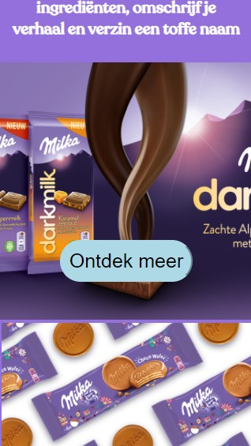
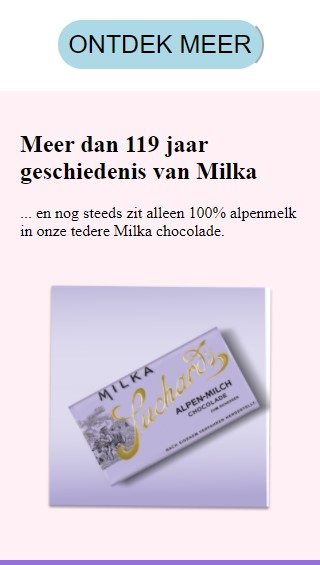
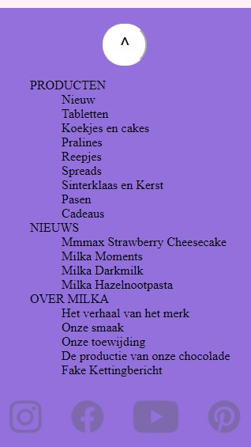
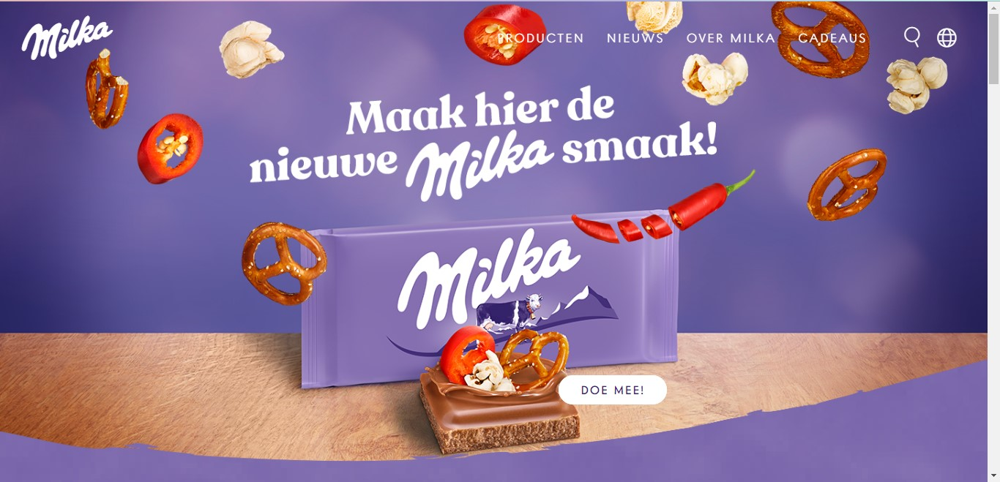
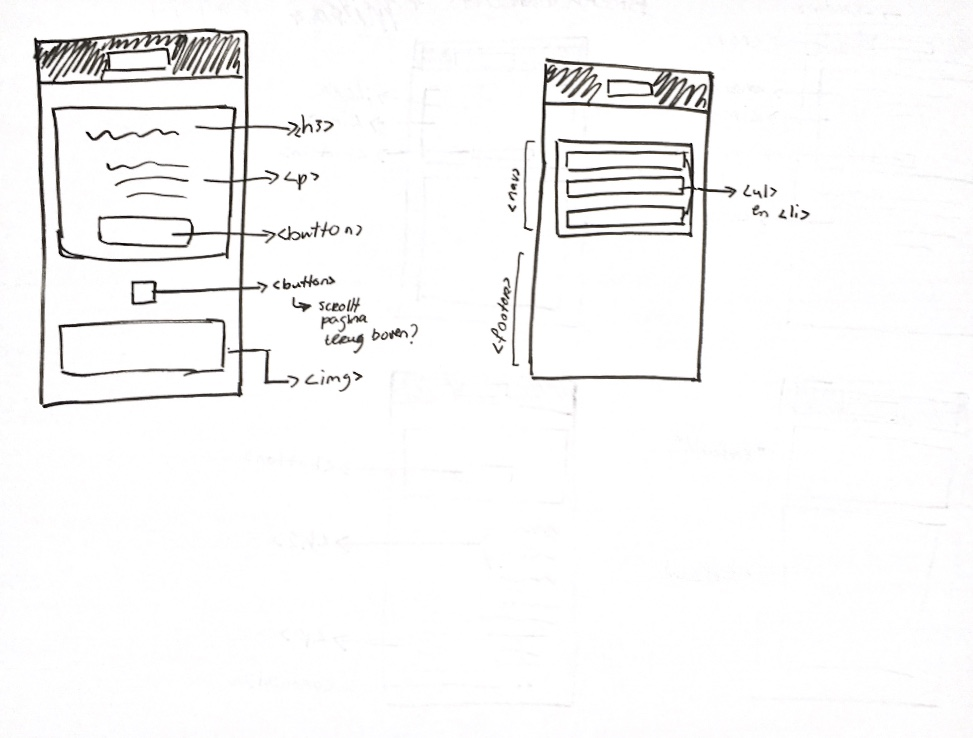

# Procesverslag
**Auteur:** -Sofya Gerges-

Markdown cheat cheet: [Hulp bij het schrijven van Markdown](https://github.com/adam-p/markdown-here/wiki/Markdown-Cheatsheet). Nb. de standaardstructuur en de spartaanse opmaak zijn helemaal prima. Het gaat om de inhoud van je procesverslag. Besteedt de tijd voor pracht en praal aan je website.

## Bronnenlijst
1. -bron 1-
2. -bron 2-
3. -...-

## Eindgesprek (week 7/8)

-dit ging goed & dit was lastig-

**Screenshot(s):**

-screenshot(s) van je eindresultaat-

## Voortgang 3 (week 6)

-same as voortgang 1-

## Voortgang 2 (week 5)

-same as voortgang 1-

## Voortgang 1 (week 3)

### Stand van zaken

-dit ging goed & dit was lastig-

Ik heb eigenlijk sinds de eerste week stap voor stap aan mijn website gewerkt.
Dus ik loop goed mee in het tempo. Love that!

Wat verder ook goed ging was, ik ben zeker niet proffesioneel met coderen, dit is mijne tweede of derde keer met html/css
en ik was eigenlijk best verrast door mijzelf. Ik had niet verwacht dat wat ik tot nu toe heb helemaal zelf heb gedaan.
(Natuurlijk met behulp van de middelen op DLO). Geen idee of alles klopt natuurlijk, maar voor het grootste geval is het zeker niet niks.

Wat ik lastig vond was, ik was vorig schooljaar heel erg gewend om veel classes te gebruiken, vorige week kwam ik erachter dat het liever niet, of met goede reden gebruikt mag worden. Ik heb dus zoveel mogelijk van mijn classes verandert in img selectoren en nth-of-type selectoren. Soms was selecteren met nth-of-type makkelijk en soms ook wat lastiger.
Ik vraag mij ook af of er bepaalde regels daar om heen zitten, of kan je hiermee alles selecteren wat je maar wilt?

Verder was het en is het voor mij heel erg veel proberen en kijken hoe het resultaat eruit komt.
Maar het is echt heel leuk als het lukt!

**Screenshot(s):**

-screenshot(s) van hoe ver je bent-

Op deze pagina moeten alleen nog mini-aanpassingen gedaan worden.

### Agenda voor meeting

-samen met je groepje opstellen-

### Verslag van meeting

We hebben ervoor gekozen om ieder vragen op te stellen, of onderwerpen waar over het algemeen meer willen weten.

## Intake (week 1)

**Je startniveau:** -kies uit zwart, rood óf blauw-

Ik kies blauw of rood,
Ik ben nog heel erg een beginner met html/css en javascript. Vorige schooljaar was de eerste keer dat ik het beiden voor het eerst heb gebruikt. Weet nu wel iets meer erover maar hoe vaker, hoe makkelijker het wordt. Dus doe het nu ook rustig aan en ik bouw langzaam verder op de kennis die al een beetje heb. 

**Je focus:** -kies uit responsive óf surface plane-

Mijn focus gaat liggen op responsive maken.  

**Je opdracht:** -link naar de website die je gaat namaken óf de naam van je eigen ontwerp-

https://www.milka.nl/

https://www.milka.nl/over-milka/geschiedenis

**Screenshot(s):**

**Breakdown-schets(en):**

![-voorlopige breakdownschets(en) van een of beide pagina's van de site die je gaat maken-]

