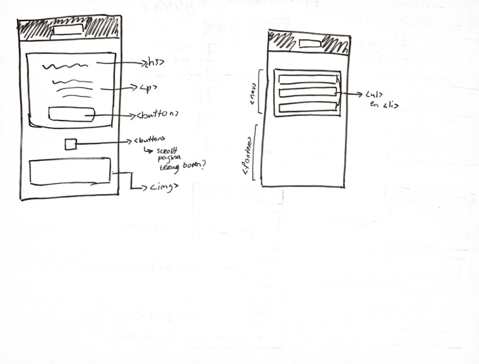

# Procesverslag
**Auteur:** -Sofya Gerges-

Markdown cheat cheet: [Hulp bij het schrijven van Markdown](https://github.com/adam-p/markdown-here/wiki/Markdown-Cheatsheet). Nb. de standaardstructuur en de spartaanse opmaak zijn helemaal prima. Het gaat om de inhoud van je procesverslag. Besteedt de tijd voor pracht en praal aan je website.

* <em>De tussentijdse updates heb ik zelf toegevoegd omdat ik eerst dacht dat je een zelf een procesboek per week moest maken, dus ik heb de andere weken hierin gezet omdat het echte procesverslag is.</em>

## Bronnenlijst
1. -bron 1-
2. -bron 2-
3. -...-

## Eindgesprek (week 7/8)

-dit ging goed & dit was lastig-

**Screenshot(s):**

-screenshot(s) van je eindresultaat-

## Voortgang 3 (week 6)

-same as voortgang 1-

## Voortgang 2 (week 5)

-dit ging goed & dit was lastig-

In week 5 heb ik best veel gedaan rondom problemen waar ik tegen aan liep te fixen. Ik heb hulp gevraagd en een aantal problemen waar ik mee zat opgelost. Een van de grootste was over hoe je iets selecteert in je html document via css (zonder gebruik te maken van classes). In de eerste weken had ik namelijk css selectoren gebruikt en toe ik verder ging en elementen toevoegde gingen zij opeens allemaal anderen delen selecteren. Hierdoor raakte mijn layout weer helemaal door de war. Ik was toen best teleurgesteld, na een aantal keren het zelf te proberen en met hulp eruit ben gekomen, kreeg ik opeens weer een motivatieboost en het maakt mij echt heel blij als ik zie dat ik dit heb gemaakt. 

Omdat ik niet in de komende weken opeens stress wil ondervinden, ben ik deze week ook al begonnen aan mijn tweede pagina. De eerste pagina is voor zo’n 75% af, ik wil er nog een aantal dingen bij doen. Tot nu gaat het best goed met de tweede pagina, ik zie best veel verschil in hoe ik aan de eerste pagina begon en hoe ik aan de tweede pagina begon. Merk echt heel erg dat ik meer kennis heb, waardoor het mij nu iets makkelijker vanaf gaat. Still not a professional but practise really makes perfect, en het is heel leuk om nu al kleine verschillen te zien! Erg leerzaam dit! 

**Screenshot(s):**

-screenshot(s) van hoe ver je bent (eerste pagina)-

-screenshot(s) van hoe ver je bent (tweede pagina)-

Deze pagina is veel langer dan de screens, maar het is een beetje herhalend, ik hoop dat ik er een leuke draai aan kan geven.

## week 4

In week 3 hadden we een voortgangsgesprek, een van de punten waar ik een vraag over had was het feit dat mijn nav met flexbox nog steeds niet goed in de center stond. De nav stond automatisch naar rechts.  Ik moest zelf uitvogelen wat het was, en na veel proberen heb ik in ‘inspecteren’ gekeken en kwam ik erachter dat er een padding van 40px stond. 

Toen heb ik gekeken of die padding handmatig had ingevuld in mij code, maar dat was niet het geval. Ik heb het toen opgelost door ‘padding-left: 0;’ toe te voegen aan mijn ul.
Was echt heel blij toen het was gelukt!!!

## Voortgang 1 (week 3)

### Stand van zaken

-dit ging goed & dit was lastig-

Ik heb eigenlijk sinds de eerste week stap voor stap aan mijn website gewerkt.
Dus ik loop goed mee in het tempo. Love that!

Wat verder ook goed ging was, ik ben zeker niet proffesioneel met coderen, dit is mijne tweede of derde keer met html/css
en ik was eigenlijk best verrast door mijzelf. Ik had niet verwacht dat wat ik tot nu toe heb helemaal zelf heb gedaan.
(Natuurlijk met behulp van de middelen op DLO). Geen idee of alles klopt natuurlijk, maar voor het grootste geval is het zeker niet niks.

Wat ik lastig vond was, ik was vorig schooljaar heel erg gewend om veel classes te gebruiken, vorige week kwam ik erachter dat het liever niet, of met goede reden gebruikt mag worden. Ik heb dus zoveel mogelijk van mijn classes verandert in img selectoren en nth-of-type selectoren. Soms was selecteren met nth-of-type makkelijk en soms ook wat lastiger.
Ik vraag mij ook af of er bepaalde regels daar om heen zitten, of kan je hiermee alles selecteren wat je maar wilt?

Verder was het en is het voor mij heel erg veel proberen en kijken hoe het resultaat eruit komt.
Maar het is echt heel leuk als het lukt!

**Screenshot(s):**

-screenshot(s) van hoe ver je bent-

Op deze pagina moeten alleen nog mini-aanpassingen gedaan worden.

### Agenda voor meeting

-samen met je groepje opstellen-

### Verslag van meeting

We hebben ervoor gekozen om ieder vragen op te stellen, of onderwerpen waar over het algemeen meer willen weten.

## Week 2

In week 2 heb ik het beginnend html-skelet opgezet van beiden websitepagina’s van Milka. Eerste pagina is de homepagina en de tweede pagina is de geschiedenispagina van Milka.
Ook een beetje CSS toevoegd!
Ik heb de positioneren en flexbox oefeningen gemaakt, ik heb verder gewerkt aan mijn website.
Hierdoor de progressie tot nu toe:
Laatste wijzinging was op vrijdag 10 september

Note: Ik had als eerst veel classes in mijn html, ik wist eerst niet dat die eigenlijk niet echt gebruikt mochten worden. Ik vond het lastig omdat ik van vorig jaar al gewend was om classes te gebruiken voor opmaak en dergelijke.
Ik heb dus voor mijn gevoel een grote stap gemaakt door de classes zoveel mogelijk weg te halen en de nth-of-type toe te passen.
Aardig gelukt, zeker blij mee!

## Week 1

Ik heb de opdracht bekeken, de stappen gevolgd om de starten met github. De intake-opdracht ingevuld en een website gekozen.
Ook heb de eerste oefeningen gemaakt van Typografie met codepen.

Na lang nadenken heb ik gekozen voor de website van Milka!
Everyone loves chocolate!

Ik heb gekozen voor Milka omdat het best vaak eet, hun signature kleur is mijn favoriete kleur en vindt hun website best speels maar ook doelgericht eruit zien. Ik vond de stijl wel leuk, ookal vind ik clean, natural en white websites ook erg mooi.

Verder heb ik een breakdownschets gemaakt van de homepagina van Milka,
een hulpmiddel om een beetje een idee te krijgen welke html-elementen gebruikt kunnen worden.

## Intake (week 1)

**Je startniveau:** -kies uit zwart, rood óf blauw-

Ik kies blauw of rood,
Ik ben nog heel erg een beginner met html/css en javascript. Vorige schooljaar was de eerste keer dat ik het beiden voor het eerst heb gebruikt. Weet nu wel iets meer erover maar hoe vaker, hoe makkelijker het wordt. Dus doe het nu ook rustig aan en ik bouw langzaam verder op de kennis die al een beetje heb. 

**Je focus:** -kies uit responsive óf surface plane-

Mijn focus gaat liggen op responsive maken.  

**Je opdracht:** -link naar de website die je gaat namaken óf de naam van je eigen ontwerp-

https://www.milka.nl/

https://www.milka.nl/over-milka/geschiedenis

**Screenshot(s):**

**Breakdown-schets(en):**

![-voorlopige breakdownschets(en) van een of beide pagina's van de site die je gaat maken-]

